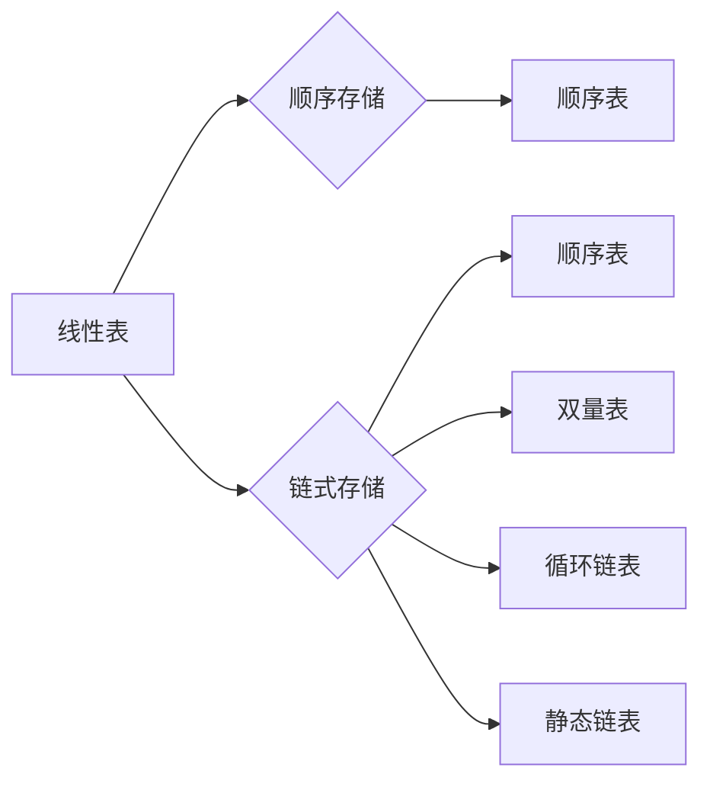

# 线性表的定义

具有相同特性的数据元素的一个有限序列，若数据元素有n个，那么表长也为n,当n为0时，线性表是一个空表。

- 表中的元素个数有限
- 表中元素具有逻辑上的顺序性，有其先后次序
- 表中都是数据元素，每个元素都是单个元素。
- 表中的元素数据类型相同，这意味着每个元素占有相同大小的存储空间
- 表中元素具有抽象性，仅讨论元素间的逻辑关系，而不考虑元素表示什么内容

# 线性表的基本操作

- InitList : 初始化表，构造空的线性表。
- Length : 求表长。返回线性表的长度，即元素的个数
- LocateElem : 按值查找操作，查找具有关键字元素的值
- GetElem : 按位查找操作。获取表中第i个位置的值
- ListInsert : 插入操作，在表L中的i个位置插入元素e
- ListDelete : 删除操作，在表L中的第i个位置删除元素，并用e返回删除元素值
- PrintfList : 输出操作。按前后顺序输出线性表所有元素值
- Empty : 判空操作。若L为空表返回true，否则返回false
- DestroyList : 销毁操作。销毁表，并释放内存空间

